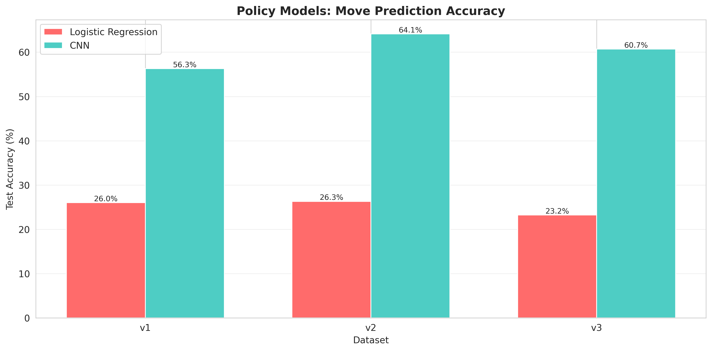
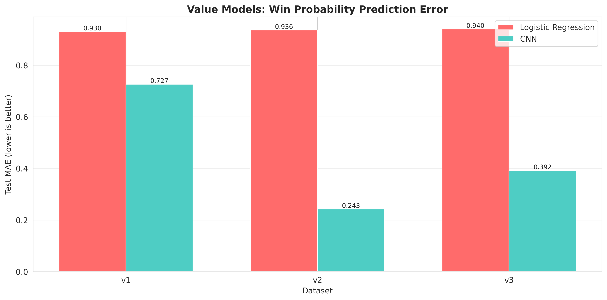
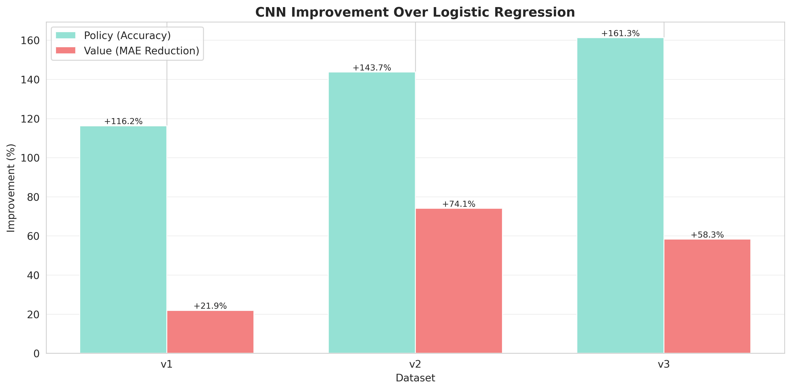
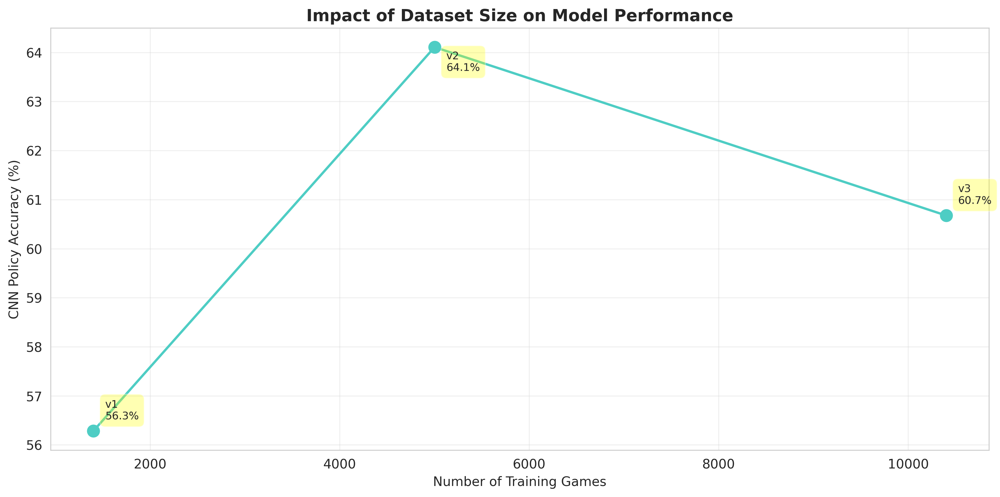

# Connect Four ML Models - Evaluation Report

**Generated:** 2025-12-21 11:04:27

---

## Summary

12 models trained across 3 datasets. Best results:

- Policy: CNN on v2 - 64.11% accuracy
- Value: CNN on v2 - 0.2429 MAE

## Datasets

| Dataset | Games | Moves |
|---------|-------|-------|
| v1 | 1,401 | 44,000 |
| v2 | 5,002 | 156,000 |
| v3 | 10,401 | 508,000 |

## Results

### Policy Models (Move Prediction)



| Dataset | LR Accuracy | CNN Accuracy | Improvement |
|---------|-------------|--------------|-------------|
| v1 | 26.03% | 56.28% | +116.2% |
| v2 | 26.30% | 64.11% | +143.7% |
| v3 | 23.22% | 60.68% | +161.3% |

### Value Models (Win Probability Prediction)



| Dataset | LR MAE | CNN MAE | Improvement |
|---------|--------|---------|-------------|
| v1 | 0.9304 | 0.7266 | +21.9% |
| v2 | 0.9363 | 0.2429 | +74.1% |
| v3 | 0.9402 | 0.3919 | +58.3% |

### CNN vs Logistic Regression



## Notes

### Dataset Size vs Performance



### CNN vs Logistic Regression

Average CNN improvement:
- Policy: +140.4%
- Value: +51.4%

## Technical Details

### Model Architectures

**CNN (Convolutional Neural Network):**
```
Input: 6x7 board
Conv2D(64 filters, 3x3) + ReLU + Padding
Conv2D(64 filters, 3x3) + ReLU + Padding
Conv2D(32 filters, 3x3) + ReLU + Padding
Flatten
Dense(128) + Dropout(0.2)
Dense(64) + Dropout(0.2)
Output: Dense(7) for policy, Dense(1) for value
Parameters: ~237k
```

**Logistic/Linear Regression:**
```
Input: Flattened board (42 features)
Output: 7 classes (policy) or 1 value (value)
Parameters: ~300
```

### Training Configuration

- **Optimizer:** Adam
- **Learning Rate:** 0.001
- **Batch Size:** 32
- **Epochs:** 50 (with early stopping)
- **Train/Val/Test Split:** 70% / 15% / 15%
- **Early Stopping:** Patience = 10 epochs

### MLFlow Tracking

All experiments tracked in MLFlow:
- **URL:** http://localhost:5002
- **Experiments:** v1_dataset, v2_dataset, v3_dataset
- **Metrics:** Training/validation loss, test accuracy, test MAE
- **Artifacts:** Model files, training curves, configuration

---
*Generated 2025-12-21 11:04:27 from MLFlow data*
